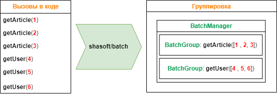
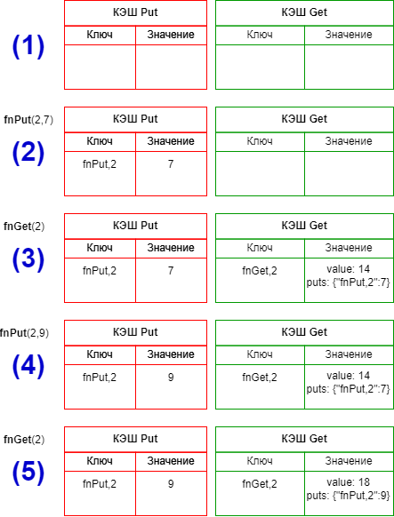

# Группировка вызовов функций через обещания

## Базовый функционал

Самое очевидное применение группировки вызовов - решение проблемы N+1 запросов. Данная проблема возникает когда фреймворк доступа к данным выполняет N дополнительных SQL-запросов для получения тех же данных, которые можно получить при выполнении одного запроса.
К примеру для получения данных имеются вызовы следующих функций, каждая из которых выполняет один SQL-запрос. При применении пакета 6 вызовов функций группируются в две группы по типу функции вызова. И в каждую группу попадают все аргументы вызова.



В результате вместо шести SQL-запросов будет выполнено всего два.

Для реализации алгоритма с картинки такой код:

```php
// Функция для получения асинхронных данных и их возврата в синхронный код
// Анонимная функция должно возвращать обещание, 
// результат которого и будет возвращен из функции run
$articles = BatchManager::run(function (): BatchPromise {
    // Функция all выполняет массив обещаний
    // и возвращает массив значений этих обещаний
    return BatchManager::all([
        getArticle(1),
        getArticle(2),
        getArticle(3)
    ]);
});

// Получить информацию о статье
function getArticle(int $id): BatchPromise
{
    // Создаем и возвращаем обещание
    return BatchManager::create(
        // Функция для обработки сгруппированных данных
        function (BatchGroup $group) {
            // Получить список уникальных значений аргумента с номером 0
            $ids = $group->arg(0);
            // Выбрать из БД информацию о статьях
            $articles = sql('SELECT * FROM `articles` WHERE `id` IN (' . implode(',', $ids) . ')');
            // Создадим обещания получения информации о пользователях
            $promises = [];
            foreach ($articles as $article) {
                $promises[] = getUser($article['author_id']);
            }
            BatchManager::all($promises)->then(function (array $users) use ($articles, $group) {
                // Сгруппировать пользователей по идентификатору
                $mUsers = [];
                foreach ($users as $user) {
                    $mUsers[$user['id']] = $user;
                }
                // Проставить информацию об авторе
                foreach ($articles as $article) {
                    $article['author'] = $mUsers[$article['author_id']];
                }
                // Сгруппировать статьи по идентификатору
                $mArticles = [];
                foreach ($articles as $article) {
                    $mArticles[$article['id']] = $article;
                }
                // Вернуть информацию о статьях
                $group->setResult(function (int $id) use ($mArticles) {
                    return $mArticles[$id] ?? null;
                });
            });
        },
        $id // Функция имеет только один аргумент (его номер = 0)
    );
}
// Получить информацию о пользователе
function getUser(int $id): BatchPromise
{
    // Создаем и возвращаем обещание
    return BatchManager::create(
        // Функция для обработки сгруппированных данных
        function (BatchGroup $group) {
            // Получить список уникальных значений аргумента с номером 0
            $ids = $group->arg(0);
            // Выбрать из БД информацию о пользователях
            $users = sql('SELECT * FROM `users` WHERE `id` IN (' . implode(',', $ids) . ')');
            // Сгруппировать пользователей по идентификатору
            $mUsers = [];
            foreach ($users as $user) {
                $mUsers[$user['id']] = $user;
            }
            // Вернуть информацию о пользователе
            $group->setResult(function (int $id) use ($mUsers) {
                return $mUsers[$id] ?? null;
            });
        },
        $id // Функция имеет только один аргумент (его номер = 0)
    );
}
```
Функция `BatchManager::all` получает на вход список объектов BatchPromise, возвращаемых групповыми функциями и выполняется когда выполнятся ВСЕ обещания из переданного массива.

## Цепочки вызовов

Как и все обещания в данном случае поддерживаются цепочки вызовов.
```php
$articles = BatchManager::run(function (): BatchPromise {
    return getArticle(1)
        ->then(function($article) {
            // Функция получает значение, его можно изменить
            $article['genderName'] = $article['gender']=='M' ? 'мужчина' : 'женщина';
            // и передать дальше по цепочке
            return $article;
        })        
        ->then(function($article) {
            // Функция получает значение, его можно изменить
            if( empty($article['avatar']) {
                $article['avatar'] = '/avatar/default.png';
            }
            // и передать дальше по цепочке
            return $article;
        });        
});
```

## Обработка ошибок

Каждая функция (обещание) может генерировать ошибку. В отличии от обещаний в том же JavaScript я в своем пакете пошёл другим путем. Вместо указания отдельной функции для получения ошибки необходимо возвращать эту ошибку с помощью вызова `BatchError:create()`. В качестве примера перепишем функцию `getUser`.
```php
// Получить информацию о пользователе
function getUser(int $id): BatchPromise
{
    // Создаем и возвращаем обещание
    return BatchManager::create(
        // Функция для обработки сгруппированных данных
        function (BatchGroup $group) {
            // Получить список уникальных значений аргументов с номером 0
            $ids = $group->arg(0);
            // Выбрать из БД информацию о пользователях
            $users = sql('SELECT * FROM `users` WHERE `id` IN (' . implode(',', $ids) . ')');
            // Сгруппировать пользователей по идентификатору
            $mUsers = [];
            foreach ($users as $user) {
                $mUsers[$user['id']] = $user;
            }
            // Вернуть информацию о пользователе
            $group->setResult(function (int $id) use ($mUsers) {
                // Возвращаем ошибку если по идентификатору ничего не выбралось
                return $mUsers[$id] ?? BatchError::create("Пользователь {$id} не найден",$id);
            });
        },
        $id
    );
}
```
При создании ошибки необходимо указать текст + (опционально) код ошибки. Также класс работы с ошибками содержит статические методы для удобной обработки ошибок.
```php
// Работа с ошибками
class BatchError
{
    // Создать ошибку
    static public function create(string $message, ?int $code = null): static;
    // Создать ошибку отсутствия значения
    static public function createUndefined(): static;
    // Значение является ошибкой?
    static public function has(mixed $value): bool;
    // Все значения массив являются ошибками?
    static public function hasErrors(array $values): bool;    
    // Отфильтровать массив значений удалив: true - ошибки/ false - не ошибки
    static public function filter(array $values, bool $removeError = true): array;
    // Заполнить ошибки значениями
    static public function fill(array $values, mixed $value): array;
}
```

## Приоритизация

В нашем случае группы будут выполняться последовательно. Т.е. в каждый момент времени в списке групп будет только одна группа. В более сложной ситуации групп может быть несколько. И в этом случае важно в какой последовательности они будут выполняться.
Возьмем пример с картинки. Предположим у нас в очереди сразу две группы: **getArticle** и **getUser**. В зависимости от последовательности выполнения групп у нас будет выполнено разное количество SQL-запросов. При такой последовательности `getArticle, getUser` 2 запроса: **getArticle**, **getUser**. При такой - `getUser, getArticle, getUser` 3 запроса: **getUser**, **getArticle**, **getUser**.

В первом случае после выполнения группы **getArticle** будут добавлены вызовы в группу **getUser**, а потом она выполнится. Во втором случае выполняется группа **getUser**, а после выполнения группы **getArticle** будет создана ещё одна группа **getUser**.
В функционале предусмотрен способ задания приоритизации с помощью расширенного создания обещания:
```php
// Получить информацию о пользователе
function getUser(int $id): BatchPromise
{
    // Создаем и возвращаем обещание
    return BatchManager::createEx(
        // Функция указания расширенных настроек
        function (BatchGroupConfig $config) {
            // Указываем пониженный приоритет (чтобы эта группа выполнялась последней)
            $config->setPriority(BatchManager::PRIORITY_LOW);
        },
        // Функция для обработки сгруппированных данных
        function (BatchGroup $group) {
            // ...
        },
        $id
    );
}
```
Теперь в независимости от того в какой очередности группы находятся в списке для выполнения, группа с пониженным приоритетом будет выполнена последней.
Для более рациональной работы необходимо для групп, которые не создают других групп, указывать пониженный приоритет. Чтобы они выполнялись в последнюю очередь.

## Кэширование

Дополнительная полезная возможность использования функций группировок вызовов - это кэширование результата работы. Для этого Все функции разделяются на несколько видов:

### Функция без КЭШирования. 
Это функция по-умолчанию. Значение функции не КЭШируется

### Функция вида LifeTime - кэширование на время. 
Самый простой вариант кэширования.
```php
class ExampleCacheLifeTime
{
    // Функция вида LifeTime - кэширование на время
    static public function fnLifeTime(int $x): BatchPromise
    {
        return BatchManager::createEx(function (BatchGroupConfig $groupConfig) {
            // Установить тип функции = LifeTime, установить время жизни = 5 минут
            $groupConfig->setCacheLifetime(5 * 60);
        }, function (BatchGroup $group) {
            // Функция получения результата для каждого набора аргументов
            $group->setResult(function (int $minValue) {
                // Вернуть случайное число от $minValue до 1000
                // и кэшировать это значение на 5 минут
                return random_int(min($minValue, 1000), 1000);
            });
        }, $x);
    }
}
```
### Функции вида Get/Put  - кэширование до изменения значения. 
Тип функции Get устанавливается в параметрах расширенного вызова + необходимо указать функции вида Put, от которых эта функция зависит. Если зависимостей нет, то кэширование выполняется навсегда. Если зависимости указаны, то значение кэшируется до изменения текущих значений.
```php
// Пример функции Get и Put
class ExampleCacheGetPut
{
    // Хранение значений
    static protected array $data = [];
    // Функция вида Get
    static public function fnGet(int $x): BatchPromise
    {
        return BatchManager::createEx(function (BatchGroupConfig $groupConfig) {
            // Установить тип функции = Get
            $groupConfig->setCacheGet();
        }, function (BatchGroup $group) {
            // Функция получения результата для каждого набора аргументов
            $group->setResult(function (int $x) {
                // Читать текущее значение 
                $ret = self::$data[$x] ?? 0;
                // Установить зависимость от функции вида Put   
                self::fnPut($x, $ret);
                // Вернуть результат
                return $ret;
            });
        }, $x);
    }
    // Функция вида Put
    public function fnPut(int $x, int $value): BatchPromise
    {
        return BatchManager::createEx(function (BatchGroupConfig $groupConfig) {
            // Установить тип функции = Put
            // Указать список индексов ключевых аргументов
            $groupConfig->setCachePut(0);
        }, function (BatchGroup $group) {
            // Функция получения результата для каждого набора аргументов
            $group->setResult(function (int $x, int $value): void {
                // Установить значение
                self::$data[$x] = $value;
            });
        }, $x, $value);
    }
}
```

Для работы кэширования необходимо установить объекты КЭШирования.
```php
    // Установить глобальные интерфейсы КЭШа 
    BatchConfig::setICache(CacheItemPoolInterface|callable|null $cacheGet, CacheItemPoolInterface|callable|null $cachePut = null): void;
```

В качестве параметров можно указать либо объект интерфейса КЭШа [CacheItemPoolInterface](https://www.php-fig.org/psr/psr-6/) либо замыкание которое такой объект возвращает.
Имеется два КЭШа
1. Для сохранения значений функций вида Get (хранит значения результатов работы функций Get)
2. Для сохранения значений функций вида Put (хранит значения зависимостей функций вида Put).
Если указать только аргумент $cacheGet, то аргумент $cachePut будет автоматически установлен в то же значение.

## Как работает кэширование вида Get/Put?


**Описание шагов**
**(1)** КЭШ Put и Get пустые
**(2)** Вызываем функцию `fnPut(2,7)` в результате в КЭШ-е Put сохраняется значение `7` с ключом `fnPut,2`.
**(3)** Вызываем функцию `fnGet(2)`. Функция проверяет значение в КЕШе Get, не находит его и вызывает групповую функцию fnGet в аргументом 2, получает результат 14 и сохраняет в КЕШ полученный результат + зависимые значения.
**(3а)** Вызываем функцию `fnGet(2)`. Функция проверяет значение в КЕШе Get по ключу `fnGet,2`, находит его и получает значение 14. Также считывается список зависимостей и проверяется что все зависимости соответствуют значениям в КЭШе Put. В данном случае они соответствуют и возвращается значение 14. Т.е. значение берется из КЭШа и групповая функция не вызывается.
**(4)** Вызываем функцию `fnPut(2,9)` в результате в КЭШ-е Put сохраняется значение `9` с ключом `fnPut,2`.
**(5)** Вызываем функцию `fnGet(2)`. Функция проверяет значение в КЕШе Get по ключу `fnGet,2`, находит его и получает значение 14. Также считывается список зависимостей и проверяется что все зависимости соответствуют значениям в КЭШе Put. В данном случае они НЕ соответствуют (7!=9) и поэтому вызывается групповая функция которая возвращает значение 18. После сохраняет в КЕШ Get полученный результат + зависимые значения.

## Режим работы с КЭШем

Групповая функция с кэшированием хороша, но иногда необходимо чтобы такая функция игнорировала значения в КЭШе и выполняла прямое чтение значения через групповую функцию. И такая возможность есть. Каждая функция возвращает объект BatchPromise содержащий метод **setCacheMode**, который позволяет установить следующий режим работы:
1. **BatchPromise::MODE_CACHE_OFF** - отключить КЭШирование. Т.е. в независимости от типа функции она будет вызвана так как обычная функция. И результат её работы не будет сохранен в КЭШе.
2. **BatchPromise::MODE_CACHE_DIRECT** - отключить КЭШирование, но сохранять изменения в КЭШ. Т.е. в независимости от типа функции она будет вызвана так как обычная функция. И результат её работы будет сохранен в КЭШе.
3. **BatchPromise::MODE_CACHE_ON** - включить КЭШирование (значение по умолчанию). Т.е. функция работает в режиме КЭШирования - читает и сохраняет значения в КЭШ.